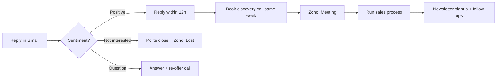

# Reply Handoff Process

**Status:** partial — needs completion  
**Ticket:** [[issues/15-reply-handoff-process]]  
**CRM:** [[zoho-workflow]]  
**Decision (partial):** [[decisions/04-crm-setup]]

---

## Locked so far

| Item | Choice |
|------|--------|
| **Reply SLA** | Within **12 hours** |
| **Discovery call** | Book **within same week** as reply |
| **After call** | Sales process + newsletter signup + follow-ups |

## Still TBD

| Item | Options |
|------|---------|
| **Who responds** | Rohith / Anirudh / Sunil / round-robin? |
| **Scheduling** | Calendly link vs manual back-and-forth? |
| **Proposal** | Template? Who sends? Timeline? |
| **Not interested** | Reply template + Zoho `Lost` + unsubscribe handling |
| **Positive reply templates** | 2–3 short templates for common cases |

## Reply flow (draft)

## Zoho updates on reply

| Event | Zoho status |
|-------|-------------|
| First reply | `Replied` |
| Call booked | `Meeting` |
| Client signed | `Converted` |
| Declined | `Lost` |

See [[zoho-workflow]].

**When locked:** close [[issues/15-reply-handoff-process]].
